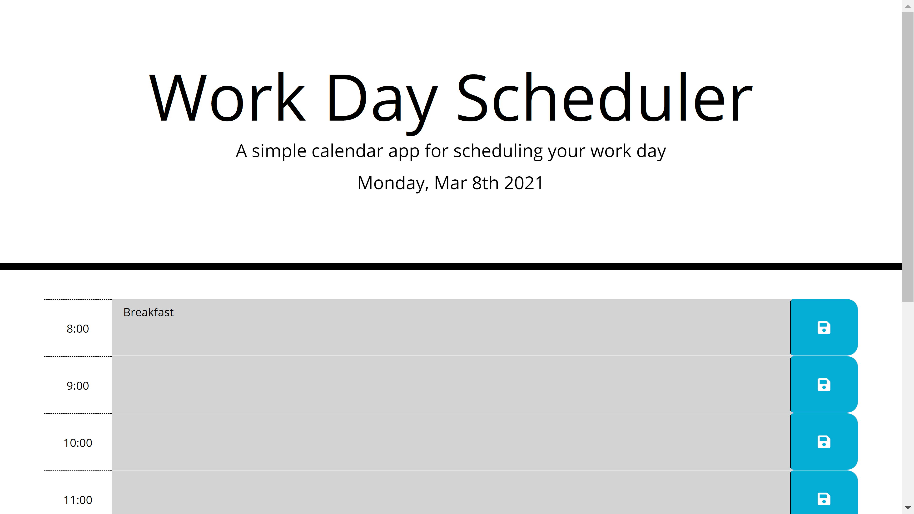
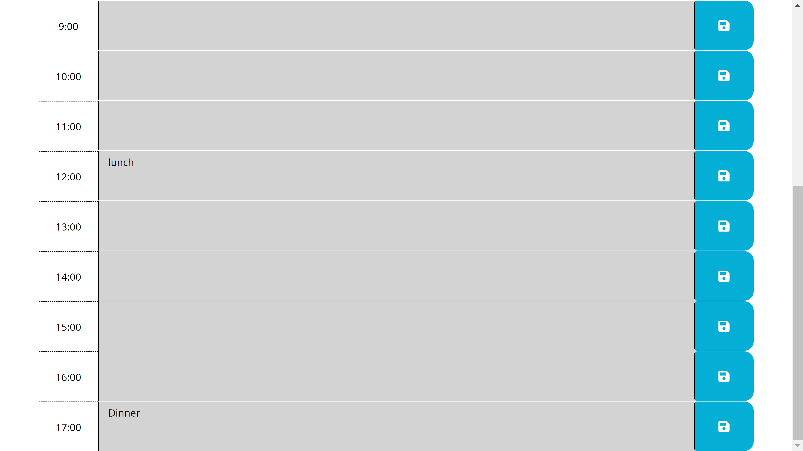

# Day-Scheduler

The day scheduler app allows you to easily add your info to a daily schedule

## Installation

Use the following link https://lordgeer.github.io/Day-Scheduler/ and get cracking

## Usage

Click on the hour block you require for your 9-17 job and type in the required task. Greyed out blocks show that the time has passed by, while green blocks show the future. Red block is finally the time at hand

## Screenshot

## Contributing
Pull requests are welcome. For major changes, please open an issue first to discuss what you would like to change.

Please make sure to update tests as appropriate.

## License
[MIT](https://choosealicense.com/licenses/mit/)